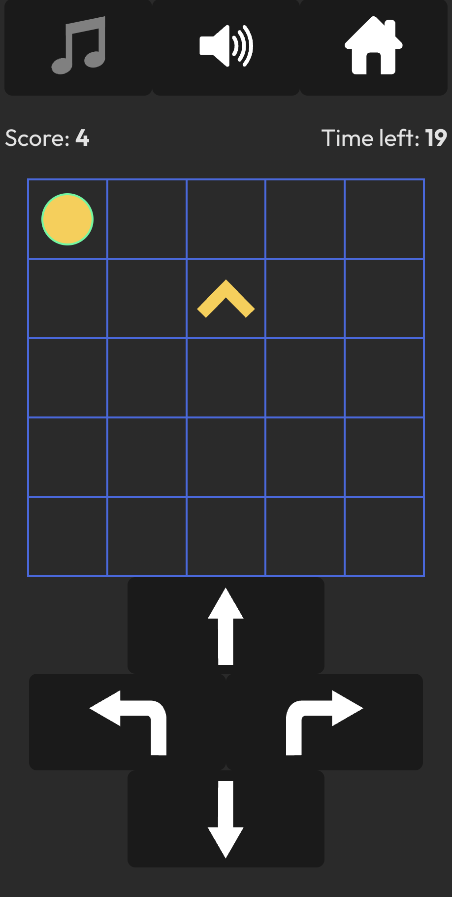
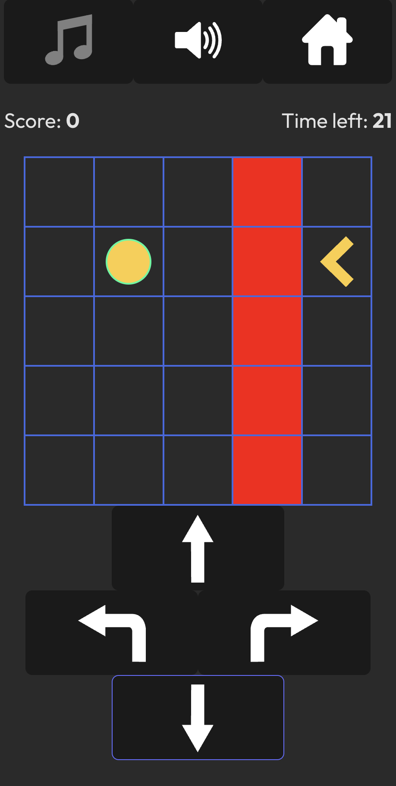
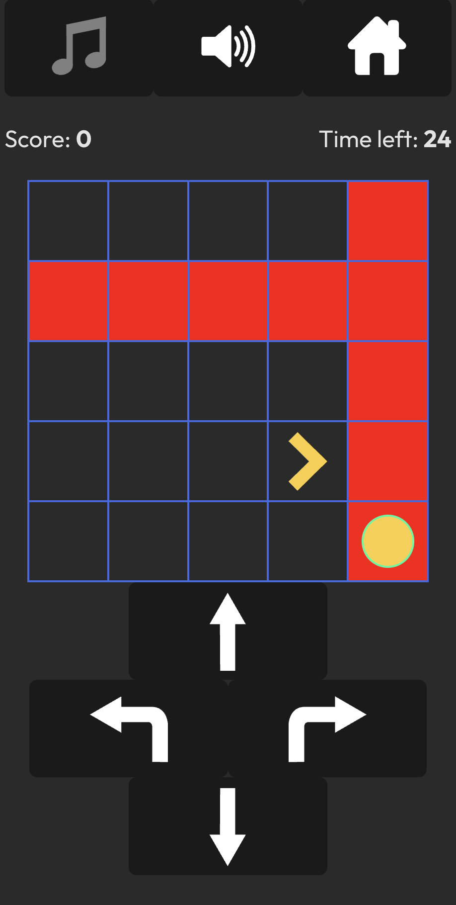

# [Coordinates](https://deanspooner.github.io/coordinates/) by [Dean Spooner](https://github.com/DeanSpooner)

## A simple set of grid-based games - what score can you get?

---

## Built with:

- TypeScript;
- React;
- Vite;
- HTML;
- CSS;
- Howler;
- Styled Components.

---

## Purpose:

To create a set of coordinate and navigation-based components, for use in other projects. I decided to expand the use of these within this to include a set of games that make use of these coordinate and navigation features.

## Difficulty modes:

### Normal

How many points can you score in 30 seconds?

### Hard

Now with rows or columns of dead cells that reset your score - how well will you do?

### Extra Hard

A row _and_ column of dead cells?! Changing even faster than before - will you score anything at all?

---

# By [Dean Spooner](https://github.com/DeanSpooner), 2024

